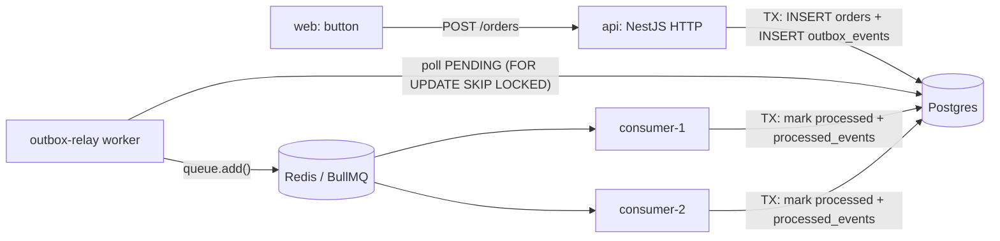

# Render Event-Driven Demo

A minimal **event-driven system** you can deploy to [Render](https://render.com):

- **`web/`** – Next.js app. One button → creates an order via the API.
- **`api/`** – NestJS. Ships **three** runnable processes from one codebase, one folder each under `src/` plus a `shared/` library:
  1. **HTTP API** (`src/api/`) – writes an `orders` row **and** an `outbox_events` row **in a single DB transaction** (transactional outbox pattern). It never talks to Redis directly.
  2. **Outbox relay** (`src/relay/`) – polls the outbox table and publishes pending events to a **Redis** queue (BullMQ), then marks them published.
  3. **Consumer** (`src/consumer/`) – a BullMQ worker that consumes events and runs the task (updates the order). Deployed **twice** (`consumer-1`, `consumer-2`) so you can watch Redis distribute jobs across instances.

  `src/shared/` holds what all three import and none of them own: the TypeORM entities (incl. the `outbox_events` table), the database module, the Redis connection factory, and the event/queue contracts.



## The three requested concepts

| Concept | Where |
| --- | --- |
| **Transaction** | `api/src/api/orders/orders.service.ts` – order + outbox row committed atomically. `api/src/consumer/order-consumer.service.ts` – order update + idempotency row committed atomically. |
| **Outbox** | `outbox_events` table (`api/src/shared/entities/outbox-event.entity.ts`). Written in the same TX as the business change; drained by `api/src/relay/outbox-relay.service.ts`. |
| **Event** | `order.created` – payload defined in `api/src/shared/events/order-events.ts`, carried through Redis to the consumers. |

Delivery is **at-least-once**: the relay publishes then marks the row `PUBLISHED`. If it crashes in between, the event is re-published. Consumers are **idempotent** via the `processed_events` table, so a duplicate delivery is a no-op.

---

## Run locally

Uses **pnpm** (`corepack enable` if you don't have it). Six terminals:

```bash
# 1. infra
docker compose up -d                       # Postgres + Redis

# 2. API (terminal 1) — the only process that creates the schema (DB_SYNC=true in .env)
cd api
cp .env.example .env
pnpm install
pnpm run dev:api                           # http://localhost:3001

# 3. Outbox relay (terminal 2)
cd api && DB_SYNC=false pnpm run dev:relay

# 4. Two consumers (terminals 3 & 4)
cd api && DB_SYNC=false RENDER_SERVICE_NAME=consumer-1 pnpm run dev:consumer
cd api && DB_SYNC=false RENDER_SERVICE_NAME=consumer-2 pnpm run dev:consumer

# 5. Web (terminal 5)
cd web
cp .env.example .env
pnpm install
pnpm run dev                               # http://localhost:3000
```

Open http://localhost:3000, click **Place order**, and watch:
- the API log commit the transaction,
- the relay log publish to Redis,
- one of the two consumers pick up the job (the table shows `processedBy: consumer-1` or `consumer-2`).

Schema is auto-created (`synchronize: true`) for demo simplicity — use migrations in production.

---

## Deploy to Render

This repo has a [`render.yaml`](./render.yaml) Blueprint. In the Render dashboard: **New → Blueprint**, point it at this repo, apply.

It provisions:

| Service | Type | Plan | Notes |
| --- | --- | --- | --- |
| `render-test-db` | Postgres | free | expires after 30 days on free |
| `render-test-kv` | Key Value (Redis) | free | `maxmemory-policy noeviction` (BullMQ requirement) |
| `api` | Web | free | public URL, `/health` healthcheck, `DB_SYNC=true` (creates the schema) |
| `web` | Web | free | `API_URL` wired to the `api` service host |
| `outbox-relay` | Worker | **starter** | Render has no free background workers |
| `consumer-1` | Worker | **starter** | |
| `consumer-2` | Worker | **starter** | distinct `RENDER_SERVICE_NAME` → visible in the orders table |

> **Cost note:** the 3 workers are `starter` (~$7/mo each) because Render does not offer free background workers. To stay fully free, change their `type` to `web` in `render.yaml` and give each a trivial port — but free web services sleep after 15 min of inactivity, which stalls the relay/consumers until the next request. Delete the Blueprint when you're done testing.

Once live, open the `web` service URL and click the button.

---

## CI / CD (GitHub Actions)

| Workflow | Trigger | What it does |
| --- | --- | --- |
| [`ci.yml`](.github/workflows/ci.yml) | every push to `main`, every PR | `pnpm install --frozen-lockfile && pnpm run build` for `api` and `web`; asserts all 3 api entrypoints compiled; runs the full outbox → Redis → consumer flow against ephemeral Postgres + Redis service containers |
| [`deploy-render.yml`](.github/workflows/deploy-render.yml) | push to `main` under `api/**` or `render.yaml` (+ manual) | rebuilds, then POSTs the Render **deploy hooks** for `api`, `outbox-relay`, `consumer-1`, `consumer-2` |
| [`deploy-vercel.yml`](.github/workflows/deploy-vercel.yml) | `web/**` — PR → preview, push to `main` → production | `vercel pull` / `vercel build` / `vercel deploy --prebuilt` |
| [`deploy-railway.yml`](.github/workflows/deploy-railway.yml) | push to `main` (+ manual); path-filtered so only the changed side deploys | rebuilds, then `railway up --ci --service …` for `api` + the 3 workers and/or `web` |

### Required repository secrets

**Render** (each service → *Settings → Deploy Hook*, copy the URL). Also switch those services' *Auto-Deploy* to **Off** so the workflow is the only trigger.

| Secret | From |
| --- | --- |
| `RENDER_DEPLOY_HOOK_API` | `api` service deploy hook |
| `RENDER_DEPLOY_HOOK_OUTBOX_RELAY` | `outbox-relay` service deploy hook |
| `RENDER_DEPLOY_HOOK_CONSUMER_1` | `consumer-1` service deploy hook |
| `RENDER_DEPLOY_HOOK_CONSUMER_2` | `consumer-2` service deploy hook |

**Vercel** — run `cd web && npx vercel link` once (project root = `web/`), then read `web/.vercel/project.json`:

| Secret | From |
| --- | --- |
| `VERCEL_TOKEN` | vercel.com → Account Settings → Tokens |
| `VERCEL_ORG_ID` | `web/.vercel/project.json` → `orgId` |
| `VERCEL_PROJECT_ID` | `web/.vercel/project.json` → `projectId` |

Also set an **`API_URL`** environment variable on the Vercel project (Production + Preview) to the Render `api` URL, e.g. `https://api-xxxx.onrender.com` — the Next.js proxy in [`web/app/api/orders/route.ts`](web/app/api/orders/route.ts) reads it.

**Railway** — one secret:

| Secret | From |
| --- | --- |
| `RAILWAY_TOKEN` | Railway → your project → *Settings → Tokens* → create a **Project token** (bound to one environment, e.g. `production`) |

Railway-side setup (once), matching the Render layout:

- **5 services** in one project: `api`, `outbox-relay`, `consumer-1`, `consumer-2` with Root Directory `api`; `web` with Root Directory `web`. Add a **Postgres** and a **Redis** plugin and reference their connection strings as `DATABASE_URL` / `REDIS_URL` on each service.
- **Build command** (all): `corepack enable && pnpm install --frozen-lockfile && pnpm run build`
- **Custom start command** per service: `pnpm run start:api` / `start:relay` / `start:consumer` / `start:consumer` / `pnpm run start` (web).
- **Variables**: `DB_SYNC=true` on `api` only; `RENDER_SERVICE_NAME=consumer-1` / `consumer-2` on the two consumers; `API_URL` on `web` = the `api` service's public URL.
- Service names in [`deploy-railway.yml`](.github/workflows/deploy-railway.yml) (`api`, `outbox-relay`, …) must match what you name them in Railway — edit the `for svc in …` list if they differ.
- If the services are GitHub-connected in Railway, they already auto-deploy on push — skip this workflow.
